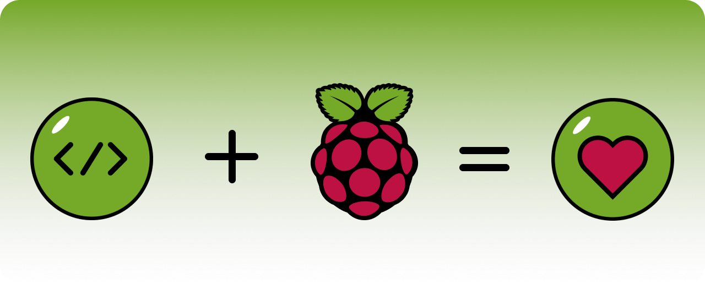

# What is PiEase?

**PiEase** is a **very simple** development environment that comes with a [prebuilt image]() **for the RaspberryPi (3 and 4)** to make your life a
   little easier out there. If you have a Raspberry Pi in your Box, or buy a fresh one - Kickstart your new Project with
   ease! No hustle, just start!

With **PiEase** you can write web applications or simple control programs for your Raspberry in no time, without
worrying
about configuration or environment.

**Plug and Play** for following Devices (link to Amazon products):

- [DS18B20](https://amzn.to/3YZJu50)
- [DH22](https://amzn.to/3YKgluL)
- [AHT20](https://amzn.to/3kc6MWC)
- [TMP117](https://amzn.to/3lOX259)
- [Relay](https://amzn.to/3xAoeag)
- [HX711 for load cell](https://amzn.to/3lMIlQ7)
- [Load Cell](https://amzn.to/41aXquI)

(...to be continued)

# Documentation

For guidance on installation and development, see the [Docs](https://docs.piease.com/)

# Get the Image

Be patient. The Image will follow soon!

(0.0.1 BETA)