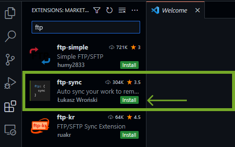
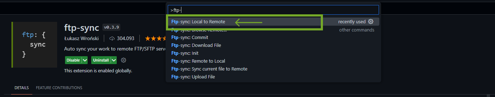
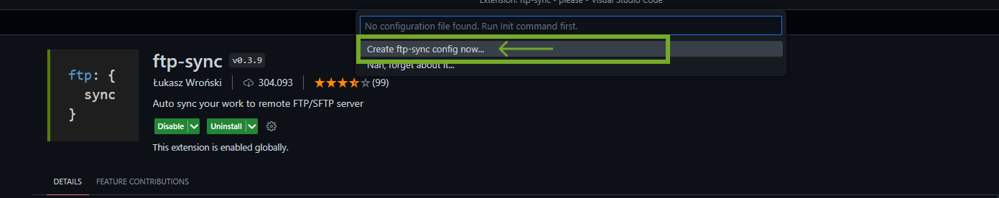
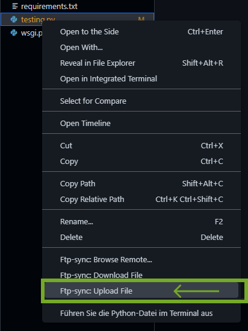
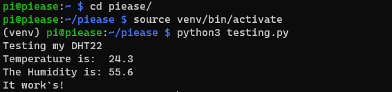

# Quick Start Guide

!> Find your Raspberry Pi IP Adresse first. It depends on your Network and Router configurations. I work here with ```192.168.0.13``` as an Example. There are many Guides to find the Adresse out there.

!> The SSH Password is ```piease``` and the User is ```pi```

## Clone the Repo and set up your Development Environment

?>[Clone](https://github.com/anderswodenker/piease) the PiEase Framework and open it with your favorite IDE like [Visual Studio Code](https://code.visualstudio.com/), or [PyCharm](https://www.jetbrains.com/de-de/pycharm/)

## Here you go for Visual Studio Code

### Set Up the FTP sync

1. Install ftp-sync plugin



2. Press ``` STRG + SHIFT + P ``` and type "ftp-". Click on the "Local to Remote" option



3. Create the ftp-sync config



Simply copy and paste into your ftp-sync.json.

!> Replace your Raspberry Pi IP Address like "192.168.0.13"
```json
{
    "remotePath": "/home/pi/piease/",
    "host": "{YOUR RASPBERRY Pi IP ADDRESS}",
    "username": "pi",
    "password": "piease",
    "port": 22,
    "secure": false,
    "protocol": "sftp",
    "uploadOnSave": false,
    "passive": false,
    "debug": false,
    "privateKeyPath": null,
    "passphrase": null,
    "agent": null,
    "allow": [],
    "ignore": [
        "\\.vscode",
        "\\.git",
        "\\.DS_Store"
    ],
    "generatedFiles": {
        "extensionsToInclude": [
            ""
        ],
        "path": ""
    }
}
```

4. Right click on the testing.py and upload the File to your Raspberry Pi



### Login to your Raspberry Pi

Login over SSH to your Rapsberry Pi with ``` ssh pi@192.168.0.13 ``` and test your code!



?> Do not forget to activate your Virtual Environment before testing.

``` shell
source venv/bin/activate
```